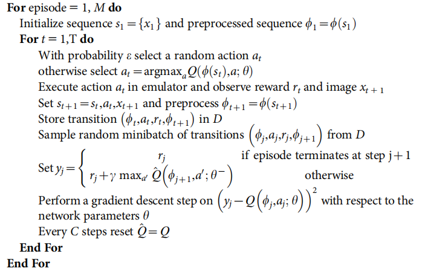

# DQN (Deep Q-Networks)
## 相关文献
+ [Playing Atari with Deep Reinforcement Learning](./asset/DQN1.pdf)
+ [Human-level control through deep reinforcement learning](./asset/DQN2.pdf)

## Playing Atari with Deep Reinforcement Learning
#### 论文总结
+ idea
  + 区分了RL和SL在应用DL时的不同之处
  + 提出了使用Deep Q-Networks来近似大规模状态空间的Q函数的算法
    + 其中，Q值网络为$Q:\mathcal{S}\rightarrow \mathbb{R}^{|\mathcal{A}|} $的映射，只需要输入状态即可得到所有行动的Q值
    + 此处状态的定义实际上是之前4个时间片被预处理后的图像
    + 优化时使用了随机梯度下降和semi-gradient思想
  + 提出了使用replay buffer来构造训练数据的想法
    + 由于replay buffer在所有之前的经验中随机采样，可以避免因为连续采样造成的样本之间的相关性
    + 每个样本均会多次使用，提高了sample efficiency
    + 避免因为最近的决策导致的样本上的主导性。比如，如果在某个时间片行动left对应的Q值最高，那么在接下来的采样中样本将被向左的行动所主导
+ 改进方向
  + replay buffer中，由于在所有的历史经验中随机采样，因而对关键样本的关注度不够。论文作者提出可使用prioritized queue进行采样
+ 实验环境
  + 作者在Atari 2600平台上进行了实验
  + 提出了两种度量
    + average episodic return，即在每个度量时间点处模拟运行计算total reward，然后取平均
    + estimated Q，即在每个度量时间点处计算所有状态处最大的Q值，然后对状态数目取平均，这一度量比第一种度量更加平滑
+ 算法伪代码  
  
  + Equation 3: (semi-gradient)
  $$L_i(\theta_i) = \mathbb{E}_{s, a\sim \rho(\cdot)}[(y_i-Q(s, a|\theta_i))^2] $$
  $$\nabla_{\theta_t}L_t(\theta_i) = \mathbb{E}_{s, a\sim\rho(\cdot),s'\sim \mathcal{E}}\left[\left(r+\gamma\max_{a'}Q(s', a'|\theta_{i-1})-Q(s, a|\theta_i)\nabla_{\theta_i}Q(s, a|\theta_i)\right)\right] $$

## Human-level control through deep reinforcement learning
+ idea
  + 感觉上和之前一篇没有太大差别
  + 引入了使用target Q进行更新的概念。即计算TD误差时，估算$s_{t+1}$的Q值时使用一个旧版本的网络$ \hat{Q} $，然后每过C个time steps更新$ \hat{Q} $到当前的Q。通过“冻结”$ \hat{Q} $而不是使用自益，可以缓解Agent状态的预测值和目标值之间关联性过强的问题
+ 伪代码  
  