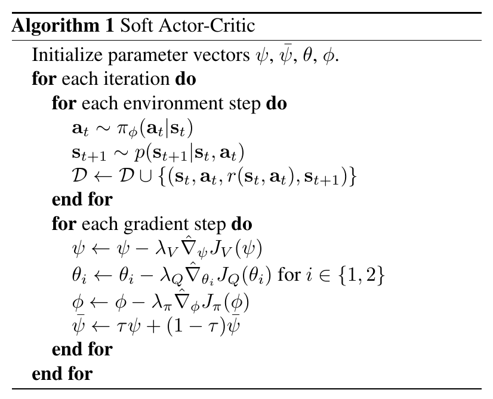

# SAC
---
## DDPG的问题
+ DDPG为off-policy策略，具有更高的采样效率，但是当将off-policy方法和高维神经网络表示结合在一起的时候，训练的稳定性和收敛性保证很差
+ DDPG很难被拓展到高维复杂的问题中，因为
  + DDPG使用了确定性策略，无法很好地解决多模态问题
  + DDPG在训练时对参数十分敏感

---
## Preliminaries
+ 使用状态的熵来增强原本强化学习的Objective
  $$J(\pi)=\sum_{t=0}^{T} \mathbb{E}_{(\boldsymbol{s}_t, \boldsymbol{a}_t)\sim \rho_\pi}[r(\boldsymbol{s}_t, \boldsymbol{a}_t)+\alpha \mathcal{H}(\pi(\cdot|\boldsymbol{s}_t))] $$
  + 有助于探索
  + 解决多模态问题

## SAC
### 原理
+ 完整算法  
  
+ 采用经典的policy-evaluation和policy-improvement框架，不过这里使用soft-Qfunction的形式
  $$ \mathcal{T}^\pi Q(\boldsymbol{s}_t, \boldsymbol{a}_t)\triangleq r(\boldsymbol{s}_t, \boldsymbol{a}_t)+\gamma \mathbb{E}_{\boldsymbol{s}_{t+1}\sim p}[V(\boldsymbol{s}_{t+1})] $$
  where
  $$V(\boldsymbol{s}_t)=\mathbb{E}_{\boldsymbol{a}_t\sim \pi}[Q(\boldsymbol{s}_t, \boldsymbol{a}_t)-\log\pi(\boldsymbol{a}_t|\boldsymbol{s}_t)] $$
  and
  $$\pi_{\text{new}}=\argmin _{\pi'\in \Pi} D_{\text{KL}}\left(\pi'(\cdot|\boldsymbol{s}_t)||\frac{\exp(Q^{\pi_{\text{old}}}(\boldsymbol{s}_t, \cdot))}{Z^{\pi_{\text{old}}}(\boldsymbol{s}_t)}\right)$$
  where $Z$ normalizes the distribution.
+ 在最初始的SAC算法中，分别使用了三个参数化的函数$V_\psi(\boldsymbol{s}_t), Q_\theta(\boldsymbol{s}_t, \boldsymbol{a}_t)$和$\pi_\phi(\boldsymbol{a}_t|\boldsymbol{s}_t)$。事实上不需要引入状态值函数，但是在实际训练的过程中作者发现引入状态值函数可以稳定训练
  + $V_\psi$的训练目标为最小化残差
    $$J_V(\psi)=\mathbb{E}_{\boldsymbol{s}_t\sim \mathcal{D}}[\frac 12(V_\psi(\boldsymbol{s}_t)-\mathbb{E}_{\boldsymbol{a}_t\sim \pi_\phi}[Q_\theta(\boldsymbol{s}_t, \boldsymbol{a}_t)-\log\pi_\phi(\boldsymbol{a}_t|\boldsymbol{s}_t)])^2] $$
    此处$ \mathcal{D} $为replay buffer中数据分布。
    相应地，偏导为
    $$\nabla_\psi J_V(\psi)=\nabla_\psi V_\psi(\boldsymbol{s}_t)(V_\psi(\boldsymbol{s}_t)-Q_\theta (\boldsymbol{s}_t, \boldsymbol{a}_t)+\log \pi_\phi(\boldsymbol{a}_t|\boldsymbol{s}_t))$$
    此处的$ \boldsymbol{a}_t $是根据当前的策略网络采样得到的，而不是replay buffer中的$ \boldsymbol{a}_t $
    <!-- TODO 关于这个a_t -->
  + 根据$Q$的更新公式（Policy Improvement）可得
  $$\nabla_\theta J_Q(\theta)=\nabla_\theta Q_\theta(\boldsymbol{s}_t, \boldsymbol{a}_t)(Q_\theta(\boldsymbol{s}_t, \boldsymbol{a}_t)-r(\boldsymbol{s}_t, \boldsymbol{a}_t)-\gamma V_{\bar{\psi}}(\boldsymbol{s}_{t+1}))$$
  此处$\bar{\psi}$是expoentially moving average of the value network weights，用于稳定训练。
  + 策略$\pi$的性能指标
  $$ J_\pi(\phi)=\mathbb{E}_{\boldsymbol{s}_t\sim \mathcal{D}}\left[D_{\text{KL}}\left(\pi_\phi(\cdot|\boldsymbol{s}_t)||\frac {\exp(Q_\theta(\boldsymbol{s}_t, \cdot))}{Z_\theta(\boldsymbol{s}_t)}\right)\right] $$
  为了缩减需要考虑的策略空间$\Pi$，我们将$\Pi$限制为可以使用均值和方差描述的高斯分布动作空间上。具体而言，行动$ \boldsymbol{a}_t $可以用由$\phi$参数化表示的神经网络$f_\phi$得到。$f_\phi$的输入为状态$ \boldsymbol{s}_t $和一个从高斯分布中采样的噪声$\epsilon_t$。则$\pi$的性能指标变为
  $$J_\pi(\phi)=\mathbb{E}_{\boldsymbol{s}_t\sim \mathcal{D}, \epsilon_t\sim \mathcal{N}}\left[\log \pi_{\phi}(f_\phi(\epsilon_t;\boldsymbol{s}_t)|\boldsymbol{s}_t)-Q_\theta(\boldsymbol{s}_t, f_\phi(\epsilon_t;s_t))+\log Z_\theta(\boldsymbol{s}_t)\right] $$
  梯度为
  $$\nabla_\pi(\phi)=(\nabla_{\boldsymbol{a}_t}\log \pi_\phi(\boldsymbol{a}_t|\boldsymbol{s}_t)-\nabla_{\boldsymbol{a}_t}Q(\boldsymbol{s}_t, \boldsymbol{a}_t))\nabla_\phi f_\phi(\epsilon_t;\boldsymbol{s}_t) $$

+ 其他细节
  + 使用duel-DQN的思路，使用两个Q-functions，取其中最小者作为value-gradient和policy-gradient中使用的Q值

### 实现
+ $Q$值网络的实现比较简单。在第一版的SAC算法中，Q值网络的更新需要借助V值网络，但是在新版的SAC算法中，由于实现了temperature $\alpha$的自动更新，就不再需要借助V值网络了。
+ 策略网络：首先使用一个网络输出均值和方差，然后根据$\epsilon$在正态分布中进行采样